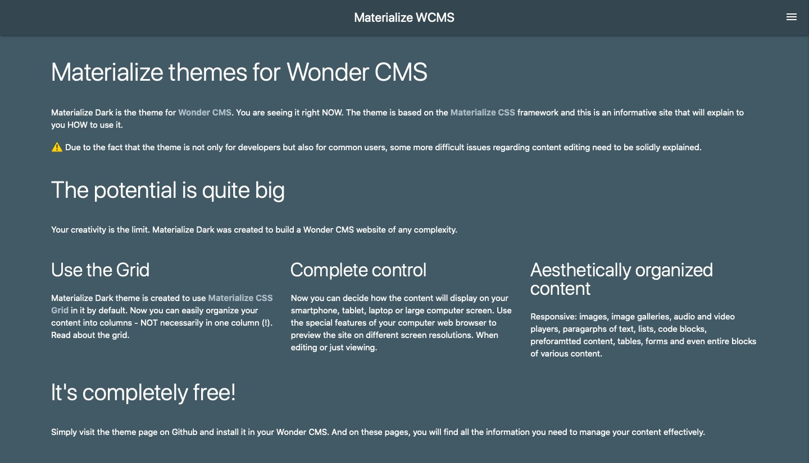

<a href="#polski">🇵🇱 Polski</a>

# 🇬🇧 Materialize Dark - theme for Wonder CMS

Author: ©2022 Paweł Krużel - @pawell0.
Made using:

* Materialize CSS framework (https://materializecss.com) - MIT licence - © 2014-2017 Materialize - https://github.com/Dogfalo/materialize/blob/master/LICENSE
* jQuery (https://jquery.com) - licencja MIT - © JS Foundation - https://github.com/jquery/jquery/blob/main/LICENSE.txt
* [Scout App](https://scout-app.io)
* Coded using [Brackets](https://brackets.io)

## About

Materialize Dark theme is a theme for Wonder CMS, based on [Materialize CSS](https://materializecss.com) framework.

The theme is designed to be used with the following plugins:

* [Additional Contents Lite 1.0.0](https://github.com/pawell0/additional-contents-lite)

## Compatibility

Theme seems to be compatible with following official Wonder CMS plugins:

* [Simple SEO 3.2.1](https://github.com/robiso/simple-seo/tree/master)
* [Hits Counter 3.0.8](https://github.com/robiso/hits-counter/tree/master)
* [Cache Thumbs 3.0.0](https://github.com/robiso/cache-thumbs/tree/master)
* [Additional Contents 3.2.2](https://github.com/robiso/summernote-editor/tree/master)
* [Summernote Editor 3.2.4](https://github.com/robiso/summernote-editor/tree/master)
* [Monaco Editor 3.0.4](https://github.com/robiso/monaco-editor/tree/master)
* [Simple Statistics 3.2.0](https://github.com/robiso/simple-statistics/tree/master)
* [Simple Blog 3.2.3](https://github.com/robiso/simple-blog/tree/master)
* Translation Plugins

The theme is not compatible with the following plugins:

* [Summernote Air Editor 3.2.0](https://github.com/robiso/summernote-air-editor/tree/master)
* [Social Bar 3.2.1](https://github.com/robiso/social-bar/blob/master/version)
* [Contact Form 3.0.1](https://github.com/robiso/contact-form/tree/master)

## Preview

## Installation

1. Login to your Wonder CMS website.
2. Click "Settings" and click "Themes" tab.
3. In a field "Custom module" at the bottom of the Settings modal paste the path: "[https://raw.githubusercontent.com/pawell0/materialize-dark/master/wcms-modules.json](https://raw.githubusercontent.com/pawell0/materialize-dark/master/wcms-modules.json)" and click the "Add" button. 
4. Click "Settings" to reopen the panel, than "Themes" tab, find the theme on the list and click "Install".
5. Click "Settings" to reopen the panel, than "Themes" tab, find the theme on the list and click "Activate" to activate the theme.

# 🇵🇱 Materialize Dark - motyw dla Wonder CMS

Autor: ©2022 Paweł Krużel - @pawell0.
Wykonane z użyciem:

* Materialize framework (https://materializecss.com) - MIT licence - © 2014-2017 Materialize - https://github.com/Dogfalo/materialize/blob/master/LICENSE
* jQuery (https://jquery.com) - licencja MIT - © JS Foundation - https://github.com/jquery/jquery/blob/main/LICENSE.txt
* [Scout App](https://scout-app.io)
* Kodowane za pomocą [Brackets](https://brackets.io)

## O motywie

Materialize Dark jest motywem dla Wonder CMS, opartym na frameworku [Materialize CSS](https://materializecss.com).

Motyw jest przeznaczony do użycia z następującymi wtyczkami:

* [Additional Contents Lite 1.0.0](https://github.com/pawell0/additional-contents-lite)

## Kompatybilność

Motyw wydaje się być kompatybilny z następującymi oficjalnymi wtyczkami Wonder CMS:

* [Simple SEO 3.2.1](https://github.com/robiso/simple-seo/tree/master)
* [Hits Counter 3.0.8](https://github.com/robiso/hits-counter/tree/master)
* [Cache Thumbs 3.0.0](https://github.com/robiso/cache-thumbs/tree/master)
* [Additional Contents 3.2.2](https://github.com/robiso/summernote-editor/tree/master)
* [Summernote Editor 3.2.4](https://github.com/robiso/summernote-editor/tree/master)
* [Monaco Editor 3.0.4](https://github.com/robiso/monaco-editor/tree/master)
* [Simple Statistics 3.2.0](https://github.com/robiso/simple-statistics/tree/master)
* [Simple Blog 3.2.3](https://github.com/robiso/simple-blog/tree/master)
* Wtyczki lokalizacji językowych

Motyw nie jest kompatybilny z następującymi wtyczkami:

* [Summernote Air Editor 3.2.0](https://github.com/robiso/summernote-air-editor/tree/master)
* [Social Bar 3.2.1](https://github.com/robiso/social-bar/blob/master/version)
* [Contact Form 3.0.1](https://github.com/robiso/contact-form/tree/master)

## Podgląd

## Instalacja

1. Zaloguj się do swojej strony Wonder CMS.
2. Kliknij "Ustawienia" i kliknij zakładkę "Motywy".
3. W polu "CUSTOM MODULE" na dole modalu "Ustawienia" wklej ścieżkę: "[https://raw.githubusercontent.com/pawell0/materialize-dark/master/wcms-modules.json](https://raw.githubusercontent.com/pawell0/materialize-dark/master/wcms-modules.json)" i kliknij przycisk "Dodaj". 
4. Kliknij "Ustawienia", aby ponownie otworzyć panel, a następnie zakładkę "Motywy", znajdź motyw na liście i kliknij "Zainstaluj".
5. Kliknij przycisk "Ustawienia", aby ponownie otworzyć panel, a następnie zakładkę "Motywy", znajdź motyw na liście i kliknij przycisk "Aktywuj", aby aktywować motyw.
